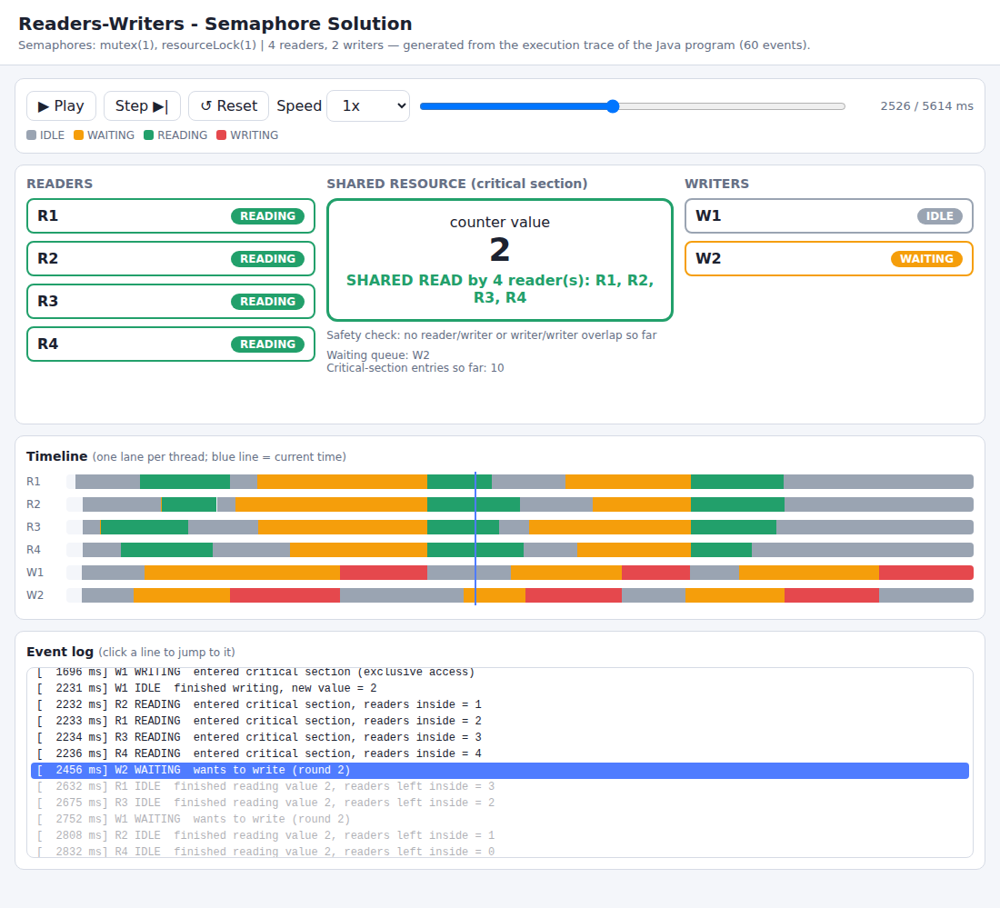
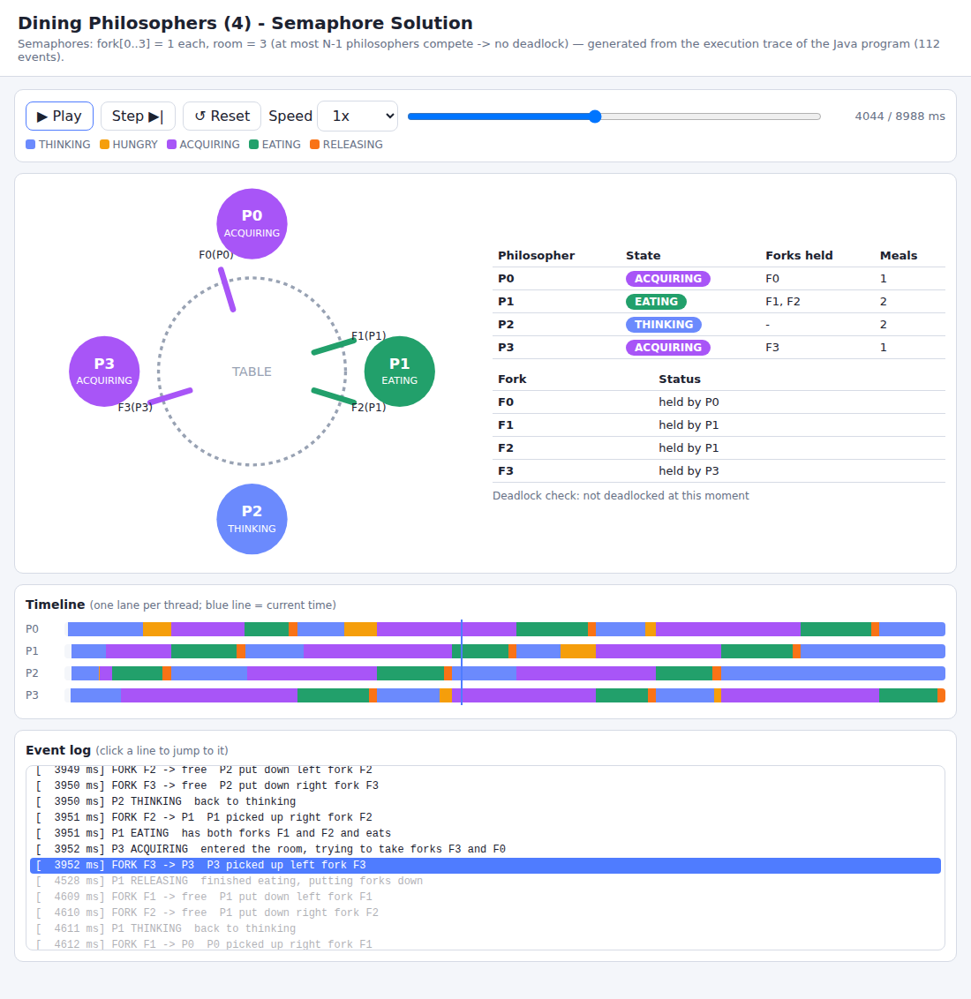

# OS Synchronization Assignment - Readers-Writers & Dining Philosophers (Java)

**Student Name:** Disha S Rao 
**USN:** NNM24IS076
**Course:** Operating Systems - AI-Assisted Synchronization and Visualization

## 1. What this project contains

Four Java programs that solve classical process-synchronization problems with **real threads**.
Each program records every state change (*events*) and, when it finishes, **generates a self-contained
HTML file** that replays the recorded execution as an animation.

| # | Program | File | Technique | Generated HTML |
|---|---------|------|-----------|----------------|
| 1 | Readers-Writers | `readers_writers/semaphore/ReadersWritersSemaphore.java` | `Semaphore` (mutex, resourceLock, optional turnstile) | `generated_html/readers_writers_semaphore.html` |
| 2 | Readers-Writers | `readers_writers/monitor/ReadersWritersMonitor.java` | Monitor = `ReentrantLock` + `Condition` variables | `generated_html/readers_writers_monitor.html` |
| 3 | Dining Philosophers (4) | `dining_philosophers/semaphore/DiningPhilosophersSemaphore.java` | 4 fork semaphores + `room` semaphore (N-1 = 3) | `generated_html/dining_philosophers_semaphore.html` |
| 4 | Dining Philosophers (4) | `dining_philosophers/monitor/DiningPhilosophersMonitor.java` | Monitor, Dijkstra state array + condition per philosopher | `generated_html/dining_philosophers_monitor.html` |

Shared helper classes (in `common/`):

* `TraceRecorder` - thread-safe event recorder (console log + JSON events).
* `SharedResource` - the shared counter used by Readers-Writers (deliberately unsynchronized, so only the semaphore/monitor protects it).
* `HtmlGenerator` - embeds the JSON events into an HTML/CSS/JS player (play, pause, step, reset, speed, scrub bar, timeline, log).

## 2. Language and tools

* **Java 17 or newer** (tested with OpenJDK 21). Text blocks are used, which need Java 15+.
* No external libraries. Only the JDK (`java.util.concurrent`).
* Any modern web browser to view the HTML (works offline).

## 3. Build / compile

Linux / macOS / Git-Bash:

```bash
mkdir -p out
javac -d out $(find . -name "*.java")
```

Windows (cmd):

```bat
mkdir out
dir /s /b *.java > sources.txt
javac -d out @sources.txt
```

Or simply run `./run.sh` (Linux/macOS) / `run.bat` (Windows), which builds **and** runs everything.

## 4. Execution (run from the repository root so the HTML goes to `generated_html/`)

```bash
java -cp out ReadersWritersSemaphore      [readers] [writers] [rounds] [seed] [outputHtml]
java -cp out ReadersWritersMonitor        [readers] [writers] [rounds] [seed] [outputHtml]
java -cp out DiningPhilosophersSemaphore  [meals] [seed] [outputHtml]
java -cp out DiningPhilosophersMonitor    [meals] [seed] [outputHtml]
```

All arguments are optional. Defaults: 4 readers, 2 writers, 3 rounds, 3 meals, seed 42.
Example (viva modification): `java -cp out ReadersWritersMonitor 6 3 2`.

## 5. Generating and viewing the HTML simulation

1. Run any program (section 4). At the end it prints `HTML simulation generated: <path>`.
2. **The file opens automatically in your default browser and the animation starts playing by itself.**
   (If no browser can be launched, e.g. on a server without a screen, open the file manually. To disable auto-open use `java -Dnoopen=true -cp out <ClassName>`.)
3. Use **Play / Pause / Step / Reset**, the **speed** selector, the **scrub bar**, or click a line of the event log.

**How the HTML is connected to the program:** the program calls `trace.state(...)` / `trace.fork(...)`
at each synchronization point. `HtmlGenerator` writes this JSON array into the page (`const TRACE = [...]`);
the browser JavaScript rebuilds the state from the events. Run the program again and the animation changes
because the thread interleaving changes. Nothing in the HTML is scripted.

The page also *checks* the invariants itself: Readers-Writers shows a red banner if a writer ever overlapped
with a reader/another writer; Dining Philosophers shows a red banner if all forks are held and nobody eats (deadlock).

## 6. Expected output

Console (excerpt, Readers-Writers semaphore):

```
[  4450 ms] R2  IDLE       finished reading value 4, readers left inside = 0
[  4450 ms] W2  WRITING    entered critical section (exclusive access)
[  5037 ms] W2  IDLE       finished writing, new value = 5
Final shared value = 6 (expected 6) -> CORRECT: no lost update, mutual exclusion held
```

Dining Philosophers ends with `Program finished => no deadlock occurred.` and the number of meals per philosopher.

Screenshots: see `screenshots/` (HTML simulations and terminal runs).




## 7. Design summary (see report for details)

* **RW semaphore:** `mutex(1)` protects `readCount`; `resourceLock(1)` is locked by the first reader / unlocked by the last reader, or held by one writer. Reader priority (writers may starve). Set `FAIR_TO_WRITERS = true` to add a `turnstile(1)` and remove writer starvation.
* **RW monitor:** one lock, conditions `okToRead` / `okToWrite`, writer priority (readers may starve).
* **DP semaphore:** `room = Semaphore(3)` lets at most 3 philosophers compete, so circular wait is impossible (deadlock prevention); fair semaphores reduce starvation.
* **DP monitor:** forks are granted *atomically* when neither neighbour is eating (no hold-and-wait, so no deadlock). Starvation is theoretically possible; meals per philosopher are printed to check.

## 8. Known limitations

* Thread scheduling is non-deterministic, so the exact order of events differs between runs even with the same seed (the seed only fixes the random delays).
* In the monitor Dining Philosophers program the `RELEASING` state has zero duration (everything inside a monitor is instantaneous), so it is visible in the log but not as a wide timeline segment.
* The monitor Dining Philosophers solution is deadlock-free but not strictly starvation-free.
* Timestamps are in milliseconds from program start; several events can share the same millisecond.

## 9. AI tools used

See `ai_prompts/prompts.md` (tool names, initial prompt, follow-ups, manual changes, reflection).

## 10. References and acknowledgements

See `references/references.md`.
